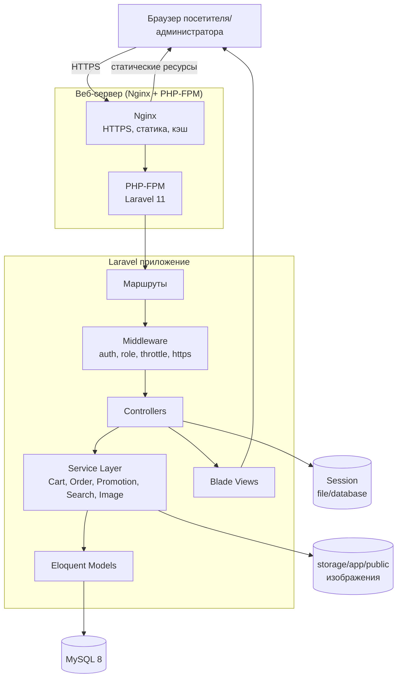
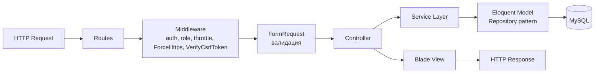
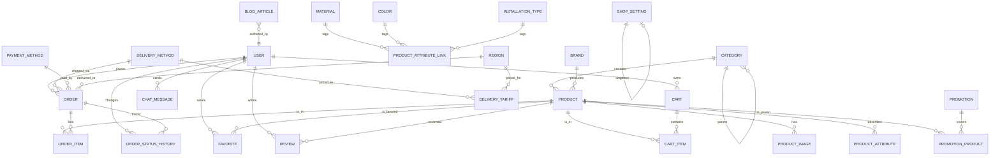
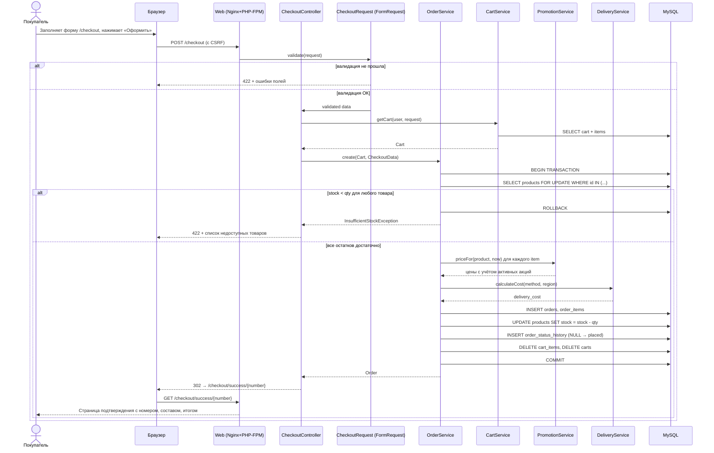
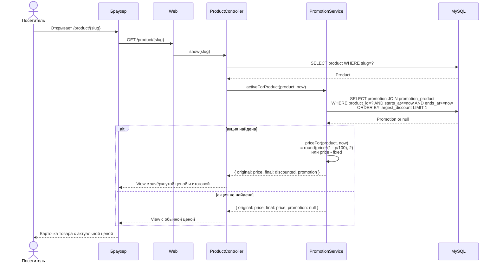

# Технический дизайн

## Overview

### Назначение

Документ описывает технический дизайн интернет-магазина сантехники для рынка Российской Федерации. Реализация выполняется в учебных целях (колледж) на стеке **Laravel 11 + MySQL 8** с серверным рендерингом через **Blade**. Магазин обеспечивает работу публичной части (каталог, корзина, оформление заказа, личный кабинет, блог, отзывы) и административной панели (управление каталогом, заказами, контентом, акциями, пользователями и настройками магазина).

### Ключевые ограничения учебного проекта

- **Нет реальной отправки email/SMS.** Email используется только как идентификатор учётной записи и реквизит заказа. Восстановление пароля выполняется через секретный вопрос/ответ.
- **Нет внешних шлюзов и платёжных провайдеров.** Способ оплаты фиксируется в БД (наличные при получении, карта при получении, банковский перевод по реквизитам), денежные транзакции в момент оформления заказа не выполняются.
- **Регион:** РФ. **Валюта:** российский рубль (₽). **Язык интерфейса:** русский. **Часовой пояс:** Europe/Moscow.
- **Сроки разработки:** 04.05.2026 – 24.05.2026 (учебный практический модуль).

### Функциональные блоки

1. Публичная часть: главная, каталог с фильтрами и сортировкой, карточка товара, поиск, корзина, оформление заказа, личный кабинет, избранное, блог, отзывы, информационные страницы, форма обратного звонка, онлайн-чат.
2. Аутентификация: регистрация по email + пароль + секретный вопрос, вход, выход, восстановление пароля без email-писем.
3. Административная панель: товары, категории, изображения, акции, заказы, статические страницы, статьи блога, отзывы (модерация), пользователи и роли, настройки магазина (контакты, способы доставки/оплаты, регионы, тарифы), банеры, обратные звонки, чат, отчёты.

### Нефункциональные цели

- DOMContentLoaded ≤ 2 c для главной и страниц категорий на стационарном соединении ≥ 10 Мбит/с (Req 24.1).
- Все формы изменения данных защищены CSRF-токеном (Req 22.4).
- Принудительный HTTPS на всех страницах (Req 22.8).
- Адаптивность от 320 до 1920 px (Req 25).

## Architecture

### Высокоуровневая архитектура

Приложение строится по классической схеме **MVC** Laravel с тонким контроллерным слоем и сервисным слоем для бизнес-логики. Серверный рендеринг страниц через Blade-шаблоны; клиентская интерактивность реализуется минимальным JavaScript (Alpine.js) для виджетов корзины, фильтров каталога, мобильного меню и онлайн-чата.



### Технологический стек

| Слой | Технология | Обоснование |
|------|-----------|-------------|
| PHP-фреймворк | Laravel 11 | Стандарт стека ТЗ; готовая аутентификация, ORM, валидация, маршрутизация |
| База данных | MySQL 8 | Указано в ТЗ |
| Аутентификация | Laravel Breeze (Blade-стек) | Лёгкий скаффолд (регистрация/вход/выход) без SPA, легко расширяется секретным вопросом |
| Шаблоны | Blade | Серверный рендер, простота, требование быстрой загрузки (Req 24.1) |
| CSS-фреймворк | TailwindCSS 3 | Утилитарные классы, быстрая адаптивность 320–1920 px (Req 25), интеграция с Breeze |
| JS-микрофреймворк | Alpine.js | Минимальная интерактивность (фильтры, корзина, чат) без построения SPA |
| Обработка изображений | Intervention Image v3 | Resize, конвертация в WebP, генерация миниатюр (Req 24.2, 24.3) |
| Sitemap | spatie/laravel-sitemap | Готовый генератор sitemap.xml (Req 23.4, 23.8) |
| Slug-генерация | Str::slug + cocur/slugify (для транслитерации кириллицы) | ЧПУ из русских названий (Req 23.1) |
| Тестирование | PHPUnit 11 + Eris (PBT) | Feature-тесты + property-based тесты для критичных участков |
| Веб-сервер | Nginx + PHP-FPM | Производительность, отдача статики, gzip, кэш-заголовки (Req 24.4) |

### Слои приложения



### Структура каталогов проекта

```
app/
├── Http/
│   ├── Controllers/
│   │   ├── Public/        (Home, Catalog, Product, Cart, Checkout, Search, Account, Favorite, Blog, Review, Page, Callback, Chat)
│   │   ├── Auth/          (Login, Register, PasswordRecovery)
│   │   └── Admin/         (Dashboard, Product, Category, Order, Promotion, Banner, Page, Article, Review, User, Setting, DeliveryMethod, PaymentMethod, Region, Tariff, Callback, Chat, Report)
│   ├── Middleware/        (RoleMiddleware, ForceHttps, ThrottleLogin)
│   ├── Requests/          (FormRequest-классы по разделам)
│   └── Resources/
├── Models/                (Eloquent-модели)
├── Services/
│   ├── CartService.php
│   ├── OrderService.php
│   ├── PromotionService.php
│   ├── SearchService.php
│   ├── ImageService.php
│   ├── PriceFormatter.php
│   └── DeliveryService.php
├── Policies/              (ProductPolicy, OrderPolicy, ArticlePolicy, ReviewPolicy, UserPolicy)
├── View/Components/       (Blade-компоненты: ProductCard, Pagination, Breadcrumbs, FilterPanel)
└── Providers/

database/
├── migrations/
├── factories/
└── seeders/

resources/
├── views/
│   ├── layouts/           (public.blade.php, admin.blade.php)
│   ├── public/
│   ├── admin/
│   └── auth/
├── lang/ru/               (auth.php, validation.php, pagination.php, app.php)
└── lang/ru.json
```

## Components and Interfaces

### Маршрутизация

#### Публичные маршруты (`routes/web.php`)

| Метод | URL | Контроллер@Метод | Назначение |
|-------|-----|------------------|------------|
| GET | `/` | `Public\HomeController@index` | Главная страница (Req 1) |
| GET | `/catalog` | `Public\CatalogController@index` | Корень каталога |
| GET | `/catalog/{slug}` | `Public\CatalogController@show` | Категория/подкатегория (Req 2, 3) |
| GET | `/product/{slug}` | `Public\ProductController@show` | Карточка товара (Req 4) |
| GET | `/search` | `Public\SearchController@index` | Поиск (Req 9) |
| GET | `/cart` | `Public\CartController@index` | Корзина (Req 5) |
| POST | `/cart/add` | `Public\CartController@add` | Добавить в корзину |
| PATCH | `/cart/{itemId}` | `Public\CartController@update` | Изменить количество |
| DELETE | `/cart/{itemId}` | `Public\CartController@remove` | Удалить позицию |
| GET | `/checkout` | `Public\CheckoutController@show` | Форма оформления (Req 6) |
| POST | `/checkout` | `Public\CheckoutController@store` | Создать заказ |
| POST | `/checkout/recalculate` | `Public\CheckoutController@recalculate` | Пересчёт суммы по способу доставки (Req 6.6) |
| GET | `/checkout/success/{orderNumber}` | `Public\CheckoutController@success` | Подтверждение |
| GET | `/login` | `Auth\LoginController@show` | Форма входа (Req 7) |
| POST | `/login` | `Auth\LoginController@store` | Авторизация |
| POST | `/logout` | `Auth\LoginController@destroy` | Выход |
| GET | `/register` | `Auth\RegisterController@show` | Форма регистрации |
| POST | `/register` | `Auth\RegisterController@store` | Создать учётную запись |
| GET | `/password/recover` | `Auth\PasswordRecoveryController@show` | Шаг 1: ввод email |
| POST | `/password/recover/question` | `Auth\PasswordRecoveryController@question` | Шаг 2: показать секретный вопрос (Req 7.9) |
| POST | `/password/recover` | `Auth\PasswordRecoveryController@reset` | Шаг 3: сменить пароль (Req 7.10) |
| GET | `/account` | `Public\AccountController@index` | Личный кабинет (Req 8) |
| GET | `/account/orders/{id}` | `Public\AccountController@order` | Детали заказа |
| POST | `/account/orders/{id}/cancel` | `Public\AccountController@cancel` | Отмена заказа покупателем |
| GET | `/favorites` | `Public\FavoriteController@index` | Избранное |
| POST | `/favorites/{productId}` | `Public\FavoriteController@toggle` | Добавить/удалить |
| GET | `/blog` | `Public\BlogController@index` | Список статей (Req 13) |
| GET | `/blog/{slug}` | `Public\BlogController@show` | Статья |
| GET | `/reviews` | `Public\ReviewController@index` | Страница отзывов (Req 14) |
| POST | `/reviews` | `Public\ReviewController@store` | Отправить отзыв (auth) |
| GET | `/about` | `Public\PageController@show` (alias) | О нас |
| GET | `/delivery` | `Public\PageController@show` | Доставка и оплата |
| GET | `/warranty` | `Public\PageController@show` | Гарантия и возврат |
| GET | `/contacts` | `Public\PageController@show` | Контакты |
| POST | `/callback` | `Public\CallbackController@store` | Обратный звонок (Req 10) |
| POST | `/chat/messages` | `Public\ChatController@store` | Отправить сообщение в чат (Req 11) |
| GET | `/sitemap.xml` | `Public\SitemapController@index` | Sitemap (Req 23.4) |
| GET | `/robots.txt` | (статический файл) | robots.txt (Req 23.5) |

#### Административные маршруты (`routes/admin.php`, prefix `/admin`)

Все маршруты под middleware `auth` + `role:admin|content-manager` (с уточнением политик на уровне действий).

| Метод | URL | Контроллер@Метод |
|-------|-----|------------------|
| GET | `/admin` | `Admin\DashboardController@index` |
| Resource | `/admin/products` | `Admin\ProductController` (CRUD, Req 15) |
| POST | `/admin/products/{id}/images` | `Admin\ProductImageController@store` |
| DELETE | `/admin/products/{id}/images/{imageId}` | `Admin\ProductImageController@destroy` |
| Resource | `/admin/categories` | `Admin\CategoryController` (Req 15.6, 15.7) |
| Resource | `/admin/promotions` | `Admin\PromotionController` (Req 16) |
| POST | `/admin/promotions/{id}/set-product-of-day` | `Admin\PromotionController@setProductOfDay` |
| Resource | `/admin/orders` | `Admin\OrderController` (Req 17) |
| PATCH | `/admin/orders/{id}/status` | `Admin\OrderController@updateStatus` |
| Resource | `/admin/banners` | `Admin\BannerController` |
| Resource | `/admin/pages` | `Admin\PageController` (Req 18.1) |
| Resource | `/admin/articles` | `Admin\ArticleController` (Req 18.2) |
| GET | `/admin/reviews` | `Admin\ReviewController@index` (Req 18.3) |
| POST | `/admin/reviews/{id}/approve` | `Admin\ReviewController@approve` |
| POST | `/admin/reviews/{id}/reject` | `Admin\ReviewController@reject` |
| Resource | `/admin/users` | `Admin\UserController` (Req 21) |
| POST | `/admin/users/{id}/block` | `Admin\UserController@block` |
| POST | `/admin/users/{id}/unblock` | `Admin\UserController@unblock` |
| GET | `/admin/settings` | `Admin\SettingController@edit` (Req 19.1) |
| PATCH | `/admin/settings` | `Admin\SettingController@update` |
| Resource | `/admin/delivery-methods` | `Admin\DeliveryMethodController` (Req 19.3) |
| Resource | `/admin/payment-methods` | `Admin\PaymentMethodController` (Req 19.3) |
| Resource | `/admin/regions` | `Admin\RegionController` (Req 19.4) |
| Resource | `/admin/tariffs` | `Admin\DeliveryTariffController` (Req 19.4) |
| Resource | `/admin/callbacks` | `Admin\CallbackController` |
| GET | `/admin/chat` | `Admin\ChatController@index` |
| POST | `/admin/chat/{sessionId}/reply` | `Admin\ChatController@reply` |
| GET | `/admin/reports/sales` | `Admin\ReportController@sales` (Req 20.1) |
| GET | `/admin/reports/traffic` | `Admin\ReportController@traffic` (Req 20.3) |
| GET | `/admin/reports/users` | `Admin\ReportController@users` (Req 20.4) |
| GET | `/admin/reports/conversion` | `Admin\ReportController@conversion` (Req 20.5) |

### Контроллеры (ключевые методы)

#### Публичные

- **HomeController**: `index()` — собирает блоки актуальных предложений, новинок (≤30 дней), активных акций, баннеров, популярных категорий, товара дня; пустые блоки скрывает (Req 1.5).
- **CatalogController**: `index()`, `show(string $slug)` — отдаёт страницу категории; запрашивает товары через `ProductRepository::filtered($filters, $sort, $page)`; учитывает иерархию (товары категории + подкатегорий — Req 2.3).
- **ProductController**: `show(string $slug)` — карточка товара с галереей, характеристиками, актуальной ценой (с учётом активных акций через `PromotionService`).
- **CartController**: `add(Request)`, `update($itemId, Request)`, `remove($itemId)`, `index()` — делегирует `CartService`.
- **CheckoutController**: `show()`, `recalculate(Request)`, `store(CheckoutRequest)`, `success($orderNumber)` — оформление через `OrderService::create($cart, $form)`.
- **SearchController**: `index(SearchRequest)` — делегирует `SearchService`.
- **AccountController**: `index()`, `order($id)`, `cancel($id)` — отмена через `OrderService::cancelByCustomer($order, $user)`.
- **FavoriteController**: `index()`, `toggle($productId)` — лимит 200 (Req 8.7).
- **BlogController**, **ReviewController**, **PageController**, **CallbackController**, **ChatController** — стандартные CRUD-проекции.

#### Аутентификация

- **LoginController**: `store(LoginRequest)` — проверяет блокировки (Req 21.5), применяет throttle (Req 7.7, 22.9), создаёт сессию 24 ч.
- **RegisterController**: `store(RegisterRequest)` — хеширует пароль (bcrypt) и ответ на секретный вопрос.
- **PasswordRecoveryController**: трёхшаговый процесс (email → секретный вопрос → новый пароль). Возвращает обобщённые ошибки (Req 7.11), завершает все сессии пользователя при успехе (Req 7.10).

#### Административные

- **Admin\ProductController** — `store(StoreProductRequest)`, `update(UpdateProductRequest)`, `destroy()` (с подтверждением).
- **Admin\CategoryController** — запрет удаления непустой категории (Req 15.7).
- **Admin\OrderController** — `updateStatus(UpdateOrderStatusRequest)` — пишет в `OrderStatusHistory` (Req 17.4).
- **Admin\PromotionController** — валидация дат и размеров скидки (Req 16.1, 16.3); `setProductOfDay($id)` снимает пометку с предыдущего (Req 16.4).
- **Admin\UserController** — блокировка с подтверждением, защита последнего админа (Req 21.8), запрет действий над собой (Req 21.6), завершение всех сессий блокируемого (Req 21.7).
- **Admin\ReportController** — отчёты по продажам/посетителям/конверсии с проверкой интервала (Req 20.2).

### Сервисный слой

#### CartService

```php
interface CartServiceInterface {
    public function getCart(?User $user, Request $request): Cart;
    public function add(Cart $cart, int $productId, int $quantity): CartItem;
    public function updateQuantity(Cart $cart, int $itemId, int $quantity): void;
    public function remove(Cart $cart, int $itemId): void;
    public function clear(Cart $cart): void;
    public function totals(Cart $cart): CartTotals; // subtotal, discount, total
    public function mergeGuestCart(Cart $guest, User $user): Cart;
}
```

Логика: количество ограничивается остатком (Req 5.1, 5.5); установка количества ≤0 удаляет позицию (Req 5.6); для гостя — корзина в БД, идентифицируется по UUID-кукам, срок жизни 14 дней (Req 5.8); цена позиции в момент расчёта берётся актуальная с учётом `PromotionService::priceFor($product)`.

#### OrderService

```php
interface OrderServiceInterface {
    public function create(Cart $cart, CheckoutData $data): Order;          // транзакция
    public function cancelByCustomer(Order $order, User $user): void;        // Req 8.5
    public function changeStatus(Order $order, string $status, User $admin): OrderStatusHistory;  // Req 17.4
    public function calculateTotal(Cart $cart, DeliveryMethod $dm, ?Region $r, ?Promotion $promo): Money;
}
```

Все операции изменения остатков выполняются в транзакции БД с блокировкой строк `FOR UPDATE` (Req 6.3, 6.4): сначала перепроверяются остатки всех товаров, затем создаётся заказ, уменьшаются остатки, очищается корзина. При отмене — возврат остатков (Req 8.5).

#### PromotionService

```php
interface PromotionServiceInterface {
    public function activeForProduct(Product $p, ?Carbon $at = null): ?Promotion;
    public function priceFor(Product $p, ?Carbon $at = null): Money;          // итоговая цена с округлением
    public function activeAtMoment(Carbon $at): Collection;                   // для главной
    public function productOfDay(): ?Product;
}
```

Округление до 2 знаков (Req 16.2). Скидка либо процент (1–99%), либо фиксированная сумма (1₽ — оригинал минус 1₽). Минимум итоговой цены > 0 (Req 16.3).

#### SearchService

```php
interface SearchServiceInterface {
    public function search(string $query, int $page = 1, int $perPage = 24): LengthAwarePaginator;
}
```

Реализация поиска: SQL `LOWER(name) LIKE LOWER(?)` по полям `name`, `sku`, `brand.name`. Сортировка: точное совпадение → префиксное → содержит, далее по популярности (Req 9.2). Минимум — 1 символ после `trim`, максимум — 100 (Req 9.1, 9.5).

#### ImageService

```php
interface ImageServiceInterface {
    public function storeProductImage(Product $p, UploadedFile $file): ProductImage;
    public function generateVariants(string $sourcePath): array;  // [thumb_300, gallery_1200] в WebP + JPEG
    public function deleteVariants(ProductImage $image): void;
}
```

Использует Intervention Image: ресайз с сохранением пропорций, качество 75–85 (Req 24.3), генерация WebP и JPEG-fallback (Req 24.5), запись в `storage/app/public/products/{productId}/`.

#### PriceFormatter

Функция-хелпер `format_price(Money $m): string` форматирует «1 234,56 ₽» с неразрывным пробелом (Req 26.2).

#### DeliveryService

```php
interface DeliveryServiceInterface {
    public function tariffFor(DeliveryMethod $dm, Region $r): ?DeliveryTariff;
    public function calculateCost(DeliveryMethod $dm, ?Region $r): Money;
}
```

### Middleware

| Middleware | Назначение | Применение |
|-----------|------------|------------|
| `auth` (стандартный) | Требует аутентификации | `/account`, `/favorites`, `/admin/*`, отправка отзывов |
| `role:admin` (свой) | Проверка роли `admin` | Большинство `/admin/*` |
| `role:admin\|content-manager` | Контент-менеджер допускается к статьям/страницам/отзывам/баннерам | `/admin/articles`, `/admin/pages`, `/admin/reviews`, `/admin/banners` |
| `throttle:login` | RateLimiter 5 попыток/15 мин на email+IP, 5/60 c на IP (Req 7.7, 22.9) | `POST /login`, `POST /password/recover` |
| `force.https` | Перенаправление HTTP→HTTPS (Req 22.8) | глобально в production |
| `VerifyCsrfToken` (стандартный) | CSRF (Req 22.4, 22.5) | глобально для web-группы |
| `EnsureUserNotBlocked` | Завершает сессию заблокированного пользователя (Req 21.5, 21.7) | глобально для web |

#### Реализация `RoleMiddleware`

```php
public function handle(Request $request, Closure $next, string ...$roles): Response {
    if (!auth()->check() || !in_array(auth()->user()->role, $roles, true)) {
        abort(403);  // Req 21.3
    }
    return $next($request);
}
```

#### RateLimiter для логина (`AppServiceProvider::boot`)

```php
RateLimiter::for('login', function (Request $r) {
    return [
        Limit::perMinutes(15, 5)->by($r->input('email').'|'.$r->ip()),
        Limit::perMinute(5)->by($r->ip()),
    ];
});
```

### Хранение и обработка изображений

- Файлы хранятся в `storage/app/public/products/{productId}/`, доступ через симлинк `public/storage`.
- Каждое исходное изображение порождает 4 варианта: `original.jpg`, `gallery_1200.webp`, `gallery_1200.jpg`, `thumb_300.webp`, `thumb_300.jpg`. Хранение пути формируется детерминированно по UUID-имени файла.
- Отдача через `<picture><source type="image/webp" srcset="..."></picture>` (Req 24.5).
- Лимиты: ≤10 МБ, JPEG/PNG/WebP (Req 15.4, 24.6), ≤10 изображений на товар (Req 15.5).
- Атрибут `alt` формируется из `product.name` (≤125 символов) (Req 23.7).
- Кэш-заголовки на статике: `Cache-Control: public, max-age=604800` (7 дней — Req 24.4) на уровне Nginx.

### SEO

- **ЧПУ:** поле `slug` уникально в пределах сущности; генерация через cocur/slugify (транслитерация кириллицы) с ручной правкой в админке. Длина ≤200 символов, только `[a-z0-9-]` (Req 23.1).
- **Мета-теги:** поля `meta_title`, `meta_description` у `Product`, `Category`, `BlogArticle`, `StaticPage`. Дефолтные значения генерируются из названия и описания, длина 10–60 / 50–160 (Req 23.2).
- **Семантика:** базовый layout использует `<header>`, `<nav>`, `<main>`, `<footer>`; одна `<h1>` на страницу (Req 23.3).
- **Schema.org:** на карточке товара — JSON-LD `Product` (`name`, `image`, `description`, `sku`, `offers.price`, `offers.priceCurrency=RUB`, `offers.availability`); в блоке отзывов — `Review` (Req 23.6).
- **sitemap.xml:** генерация через `spatie/laravel-sitemap` командой Artisan `sitemap:generate`, запускаемой задачей расписания каждый час (укладывается в 24 часа из Req 23.8); включает категории, товары, статьи, статические страницы.
- **robots.txt:** статический файл в `public/robots.txt`, разрешает публичные разделы, запрещает `/admin`, `/cart`, `/checkout`, `/account`.

### Безопасность

| Требование | Реализация |
|------------|-----------|
| 22.1 bcrypt cost ≥10 | `config/hashing.php` `'rounds' => 12` |
| 22.2 Параметризованные запросы | Только Eloquent / Query Builder, прямой SQL запрещён |
| 22.3 XSS-экранирование | Blade `{{ }}` по умолчанию; `{!! !!}` запрещён в публичных шаблонах (lint-правило) |
| 22.4–22.5 CSRF | `VerifyCsrfToken` глобально, директива `@csrf` в формах |
| 22.6–22.7 Авторизация | Policies + `role:` middleware, проверка до изменения данных |
| 22.8 HTTPS | `force.https` middleware + `URL::forceScheme('https')` в production |
| 22.9 Rate-limit | RateLimiter «login» по IP и email |
| 7.2 Хеш ответа на секретный вопрос | `Hash::make($answer)` (с нормализацией: `mb_strtolower(trim($answer))`) |

### Сессии и гостевая корзина

- Сессии: драйвер `database` (таблица `sessions`), время жизни 24 ч для авторизованных (Req 7.5).
- Гостевая корзина:
  - Создаётся в БД (`carts.session_id` = UUID из cookie `cart_token`).
  - Cookie `cart_token`: `HttpOnly`, `Secure`, `SameSite=Lax`, срок 14 дней (Req 5.8); продлевается при каждом изменении корзины.
  - Очистка раз в сутки командой `php artisan cart:purge-expired` через scheduler (карты, у которых `updated_at` старше 14 дней).
  - При входе пользователя — `CartService::mergeGuestCart()` объединяет позиции (суммирование с проверкой остатка).

### Локализация и форматирование

- Языковые файлы: `resources/lang/ru/auth.php`, `validation.php`, `pagination.php`, `passwords.php`, `app.php`; `resources/lang/ru.json` для строк интерфейса.
- `config/app.php`: `'locale' => 'ru'`, `'fallback_locale' => 'ru'`, `'timezone' => 'Europe/Moscow'`.
- Денежные суммы: класс `App\Support\Money` (`amount` int копейки, `currency = RUB`); функция `format_price()` возвращает «1 234,56 ₽» (Req 26.2).
- Даты: глобальный макрос `Carbon::macro('toRu', fn() => $this->format('d.m.Y'))` и `toRuDateTime()` для `d.m.Y H:i` (Req 26.3).
- Отсутствие перевода: middleware `LogMissingTranslations` пишет в `storage/logs/missing-translations.log` и отдаёт ключ без префикса (Req 26.4).

## Data Models

### Перечень сущностей и связи



### Схема таблиц (миграции)

#### users (Req 7, 21)

| Поле | Тип | Ограничения | Назначение |
|------|-----|-------------|-----------|
| id | bigint unsigned PK | AUTO | |
| email | varchar(254) | UNIQUE, NOT NULL | Идентификатор (Req 7.2) |
| password | varchar(255) | NOT NULL | bcrypt-хеш |
| name | varchar(150) | NULL | ФИО для заказов |
| phone | varchar(20) | NULL | |
| role | enum('customer','admin','content_manager') | NOT NULL DEFAULT 'customer' | Req 21.2 |
| status | enum('active','blocked') | NOT NULL DEFAULT 'active' | Req 21.4–21.5 |
| secret_question | varchar(200) | NOT NULL | Req 7.2 |
| secret_answer_hash | varchar(255) | NOT NULL | bcrypt-хеш ответа |
| email_verified_at | timestamp | NULL | (поле от Breeze, не используется для писем) |
| remember_token | varchar(100) | NULL | |
| created_at, updated_at | timestamps | | |

Индексы: `UNIQUE(email)`, `INDEX(role)`, `INDEX(status)`.

#### categories (Req 2, 15.6)

| Поле | Тип | Ограничения |
|------|-----|-------------|
| id | bigint PK | |
| parent_id | bigint NULL | FK→categories.id ON DELETE RESTRICT |
| name | varchar(100) | NOT NULL |
| slug | varchar(200) | UNIQUE NOT NULL |
| description | text | NULL |
| meta_title | varchar(60) | NULL |
| meta_description | varchar(160) | NULL |
| sort_order | int | DEFAULT 0 |
| is_popular | boolean | DEFAULT false |
| level | tinyint | NOT NULL (1–3, Req 2.2) |
| created_at, updated_at | | |

Индексы: `UNIQUE(slug)`, `UNIQUE(parent_id, name)` (Req 2.2), `INDEX(parent_id, sort_order)`, `INDEX(is_popular)`.

#### brands

| Поле | Тип | Ограничения |
|------|-----|-------------|
| id | bigint PK | |
| name | varchar(100) | UNIQUE NOT NULL |
| slug | varchar(120) | UNIQUE |

#### materials, colors, installation_types

Структура аналогична `brands`: `id`, `name varchar(100) UNIQUE`, `slug`.

#### products (Req 4, 15)

| Поле | Тип | Ограничения |
|------|-----|-------------|
| id | bigint PK | |
| category_id | bigint | FK→categories.id ON DELETE RESTRICT |
| brand_id | bigint NULL | FK→brands.id ON DELETE SET NULL |
| sku | varchar(64) | UNIQUE NOT NULL |
| name | varchar(200) | NOT NULL |
| slug | varchar(200) | UNIQUE NOT NULL |
| description | text | NULL (≤5000) |
| price_kopecks | bigint unsigned | NOT NULL (хранение в копейках) |
| stock | int unsigned | NOT NULL DEFAULT 0 (0–999 999) |
| warranty_months | smallint | NULL |
| dimensions | varchar(120) | NULL |
| package_contents | varchar(500) | NULL |
| status | enum('active','archived') | DEFAULT 'active' |
| popularity_score | int | DEFAULT 0 (для сортировки «по популярности», Req 3.5) |
| meta_title | varchar(60) | NULL |
| meta_description | varchar(160) | NULL |
| created_at, updated_at | | |

Индексы: `UNIQUE(slug)`, `UNIQUE(sku)`, `INDEX(category_id, status)`, `INDEX(brand_id)`, `INDEX(stock)`, `INDEX(price_kopecks)`, `INDEX(created_at)`, `INDEX(popularity_score)`, FULLTEXT(`name`, `sku`).

Замечание: цена хранится в копейках (`bigint`) для исключения проблем с округлением; в Eloquent добавлен accessor `getPriceAttribute(): Money`.

#### product_images (Req 15.4–15.5, 24.2)

| Поле | Тип | Ограничения |
|------|-----|-------------|
| id | bigint PK | |
| product_id | bigint | FK ON DELETE CASCADE |
| original_path | varchar(255) | |
| thumb_path_webp | varchar(255) | |
| thumb_path_jpg | varchar(255) | |
| gallery_path_webp | varchar(255) | |
| gallery_path_jpg | varchar(255) | |
| alt | varchar(125) | (Req 23.7) |
| sort_order | int | DEFAULT 0 |
| is_primary | boolean | DEFAULT false |

Индексы: `INDEX(product_id, sort_order)`, частичный уникальный «один primary на товар» (на уровне приложения).

#### product_attributes (Req 15.8)

| Поле | Тип | Ограничения |
|------|-----|-------------|
| id | bigint PK | |
| product_id | bigint | FK ON DELETE CASCADE |
| name | varchar(100) | NOT NULL |
| value | varchar(500) | NOT NULL |
| sort_order | int | DEFAULT 0 |

Индексы: `INDEX(product_id)`, `UNIQUE(product_id, name)`.

#### product_attribute_links (для фильтров: материал/цвет/тип установки)

| Поле | Тип |
|------|-----|
| id | bigint PK |
| product_id | bigint FK |
| material_id | bigint NULL FK |
| color_id | bigint NULL FK |
| installation_type_id | bigint NULL FK |

Альтернатива — три отдельных pivot-таблицы `product_material`, `product_color`, `product_installation_type` (по одному pivot на справочник, что чище):

- `product_material(product_id, material_id)` PK(product_id, material_id), FK → CASCADE
- `product_color(product_id, color_id)`
- `product_installation_type(product_id, installation_type_id)`

Принимаем второй вариант (три pivot-таблицы) как нормализованный.

#### carts, cart_items (Req 5)

```sql
carts:
  id BIGINT PK
  user_id BIGINT NULL FK→users.id ON DELETE CASCADE
  session_id VARCHAR(64) NULL UNIQUE          -- для гостей
  expires_at TIMESTAMP NULL                    -- для гостей: created_at + 14 дней
  created_at, updated_at TIMESTAMPS
  CHECK (user_id IS NOT NULL OR session_id IS NOT NULL)

cart_items:
  id BIGINT PK
  cart_id BIGINT FK→carts.id ON DELETE CASCADE
  product_id BIGINT FK→products.id ON DELETE CASCADE
  quantity INT UNSIGNED NOT NULL              -- ≥1
  created_at, updated_at TIMESTAMPS
  UNIQUE(cart_id, product_id)
```

Индексы: `UNIQUE(carts.user_id)` (один кошелёк на пользователя), `INDEX(carts.expires_at)`, `INDEX(cart_items.cart_id)`.

#### orders, order_items, order_status_history (Req 6, 8, 17)

```sql
orders:
  id BIGINT PK
  number VARCHAR(20) UNIQUE NOT NULL          -- человекочитаемый номер: ORD-2026-000123
  user_id BIGINT NULL FK→users.id ON DELETE SET NULL  -- может быть гостевой
  customer_name VARCHAR(150) NOT NULL
  customer_phone VARCHAR(20) NOT NULL
  customer_email VARCHAR(254) NOT NULL
  delivery_address VARCHAR(500) NOT NULL
  delivery_method_id BIGINT FK→delivery_methods.id ON DELETE RESTRICT
  payment_method_id BIGINT FK→payment_methods.id ON DELETE RESTRICT
  region_id BIGINT NULL FK→regions.id
  delivery_cost_kopecks BIGINT UNSIGNED NOT NULL DEFAULT 0
  subtotal_kopecks BIGINT UNSIGNED NOT NULL    -- сумма позиций до доставки
  total_kopecks BIGINT UNSIGNED NOT NULL       -- subtotal + delivery_cost
  comment VARCHAR(1000) NULL
  status ENUM('placed','processing','shipped','delivered','completed','cancelled') NOT NULL DEFAULT 'placed'
  created_at, updated_at TIMESTAMPS
  INDEX(user_id, created_at), INDEX(status), INDEX(created_at)

order_items:
  id BIGINT PK
  order_id BIGINT FK→orders.id ON DELETE CASCADE
  product_id BIGINT FK→products.id ON DELETE RESTRICT
  product_name_snapshot VARCHAR(200) NOT NULL  -- фиксация на момент заказа
  product_sku_snapshot VARCHAR(64) NOT NULL
  unit_price_kopecks BIGINT UNSIGNED NOT NULL  -- цена за единицу с учётом акций
  quantity INT UNSIGNED NOT NULL
  line_total_kopecks BIGINT UNSIGNED NOT NULL
  promotion_id BIGINT NULL FK→promotions.id ON DELETE SET NULL
  INDEX(order_id), INDEX(product_id)

order_status_history:
  id BIGINT PK
  order_id BIGINT FK→orders.id ON DELETE CASCADE
  from_status VARCHAR(20) NULL
  to_status VARCHAR(20) NOT NULL
  changed_by_user_id BIGINT NULL FK→users.id ON DELETE SET NULL
  changed_at TIMESTAMP NOT NULL
  comment VARCHAR(500) NULL
  INDEX(order_id, changed_at)
```

Замечание: статусы покупательской и административной воронок отображаются на одном поле `status`. Для покупателя «placed»→«Оформлен», «processing»→«В обработке», «shipped»→«Отправлен», «delivered»→«Доставлен», «cancelled»→«Отменён» (Req 8.2). Для администратора отображается полный набор включая «completed»/«Выполнен» (Req 17.3).

#### favorites (Req 8.7)

```sql
favorites:
  id BIGINT PK
  user_id BIGINT FK→users.id ON DELETE CASCADE
  product_id BIGINT FK→products.id ON DELETE CASCADE
  created_at TIMESTAMP
  UNIQUE(user_id, product_id)        -- запрет дубликатов
  INDEX(user_id, created_at)
```

Лимит «до 200» проверяется в `FavoriteController::toggle()` (бизнес-правило).

#### reviews (Req 14, 18.3)

```sql
reviews:
  id BIGINT PK
  user_id BIGINT FK→users.id ON DELETE CASCADE
  product_id BIGINT NULL FK→products.id ON DELETE CASCADE   -- NULL = отзыв о магазине
  rating TINYINT UNSIGNED NOT NULL CHECK (rating BETWEEN 1 AND 5)
  body VARCHAR(2000) NOT NULL
  status ENUM('pending','approved','rejected') NOT NULL DEFAULT 'pending'
  moderated_by_user_id BIGINT NULL FK→users.id ON DELETE SET NULL
  moderated_at TIMESTAMP NULL
  created_at, updated_at TIMESTAMPS
  INDEX(status, created_at), INDEX(product_id, status)
```

#### blog_articles (Req 13, 18.2)

```sql
blog_articles:
  id BIGINT PK
  author_user_id BIGINT FK→users.id ON DELETE RESTRICT
  title VARCHAR(200) NOT NULL
  slug VARCHAR(200) UNIQUE NOT NULL
  excerpt VARCHAR(300) NULL
  body LONGTEXT NOT NULL                   -- ≤50 000 символов
  thumbnail_path VARCHAR(255) NULL
  status ENUM('draft','published') NOT NULL DEFAULT 'draft'
  published_at TIMESTAMP NULL
  meta_title VARCHAR(60) NULL
  meta_description VARCHAR(160) NULL
  created_at, updated_at TIMESTAMPS
  INDEX(status, published_at)
```

#### static_pages (Req 12, 18.1)

```sql
static_pages:
  id BIGINT PK
  key ENUM('about','delivery','warranty','contacts') UNIQUE NOT NULL
  title VARCHAR(200) NOT NULL
  body LONGTEXT NOT NULL                   -- ≤50 000 символов
  meta_title VARCHAR(60) NULL
  meta_description VARCHAR(160) NULL
  updated_at TIMESTAMP
```

#### callback_requests (Req 10)

```sql
callback_requests:
  id BIGINT PK
  name VARCHAR(50) NOT NULL
  phone VARCHAR(20) NOT NULL
  status ENUM('new','processed') NOT NULL DEFAULT 'new'
  comment VARCHAR(1000) NULL
  created_at TIMESTAMP, updated_at TIMESTAMP
  INDEX(status, created_at)
```

#### chat_sessions, chat_messages (Req 11)

```sql
chat_sessions:
  id BIGINT PK
  user_id BIGINT NULL FK→users.id ON DELETE SET NULL
  visitor_token VARCHAR(64) NULL          -- для гостей
  status ENUM('open','closed') DEFAULT 'open'
  created_at, updated_at TIMESTAMPS
  UNIQUE(visitor_token)

chat_messages:
  id BIGINT PK
  chat_session_id BIGINT FK→chat_sessions.id ON DELETE CASCADE
  sender ENUM('visitor','support') NOT NULL
  author_user_id BIGINT NULL FK→users.id ON DELETE SET NULL
  body VARCHAR(2000) NOT NULL
  created_at TIMESTAMP
  INDEX(chat_session_id, created_at)
```

#### promotions, promotion_product (Req 16)

```sql
promotions:
  id BIGINT PK
  name VARCHAR(150) NOT NULL
  slug VARCHAR(200) UNIQUE NULL
  discount_type ENUM('percent','fixed') NOT NULL
  discount_percent TINYINT UNSIGNED NULL CHECK (discount_percent BETWEEN 1 AND 99)
  discount_fixed_kopecks BIGINT UNSIGNED NULL
  starts_at DATETIME NOT NULL
  ends_at DATETIME NOT NULL
  is_product_of_day BOOLEAN NOT NULL DEFAULT FALSE
  description TEXT NULL
  banner_image_path VARCHAR(255) NULL
  CHECK (ends_at > starts_at)
  CHECK ((discount_type='percent' AND discount_percent IS NOT NULL) OR (discount_type='fixed' AND discount_fixed_kopecks IS NOT NULL))
  INDEX(starts_at, ends_at)

promotion_product:
  promotion_id BIGINT FK→promotions.id ON DELETE CASCADE
  product_id BIGINT FK→products.id ON DELETE CASCADE
  PRIMARY KEY(promotion_id, product_id)
  INDEX(product_id)
```

Инвариант: одновременно активной может быть только одна `promotions.is_product_of_day = true` — обеспечивается транзакцией в `PromotionService::setProductOfDay()` (UPDATE снимает флаг у всех остальных).

#### banners (главная страница, Req 1.1, 1.4)

```sql
banners:
  id BIGINT PK
  title VARCHAR(200) NOT NULL
  image_path VARCHAR(255) NOT NULL
  link_url VARCHAR(500) NOT NULL
  promotion_id BIGINT NULL FK→promotions.id ON DELETE SET NULL
  category_id BIGINT NULL FK→categories.id ON DELETE SET NULL
  starts_at DATETIME NULL
  ends_at DATETIME NULL
  sort_order INT DEFAULT 0
  is_active BOOLEAN DEFAULT TRUE
  INDEX(is_active, starts_at, ends_at)
```

#### shop_settings (Req 12, 19.1)

Хранится как singleton (одна строка с `id=1`).

```sql
shop_settings:
  id TINYINT PK DEFAULT 1
  phones JSON NOT NULL                    -- массив строк, 1–5 элементов
  emails JSON NOT NULL                    -- 1–5 элементов
  postal_address VARCHAR(500) NOT NULL
  working_hours VARCHAR(500) NOT NULL
  chat_enabled BOOLEAN NOT NULL DEFAULT TRUE        -- Req 11.1–11.2
  updated_at TIMESTAMP
```

#### delivery_methods, payment_methods (Req 19.3)

```sql
delivery_methods:
  id BIGINT PK
  name VARCHAR(100) UNIQUE NOT NULL
  is_enabled BOOLEAN NOT NULL DEFAULT TRUE
  sort_order INT DEFAULT 0

payment_methods:
  id BIGINT PK
  name VARCHAR(100) UNIQUE NOT NULL                  -- «Наличные при получении», «Карта при получении», «Банковский перевод»
  is_enabled BOOLEAN NOT NULL DEFAULT TRUE
  sort_order INT DEFAULT 0
```

#### regions, delivery_tariffs (Req 19.4–19.5)

```sql
regions:
  id BIGINT PK
  name VARCHAR(100) UNIQUE NOT NULL

delivery_tariffs:
  id BIGINT PK
  delivery_method_id BIGINT FK→delivery_methods.id ON DELETE CASCADE
  region_id BIGINT FK→regions.id ON DELETE CASCADE
  cost_kopecks BIGINT UNSIGNED NOT NULL              -- 0..100 000 000 (1 000 000,00 ₽)
  UNIQUE(delivery_method_id, region_id)
```

#### page_views (для Req 20.3)

```sql
page_views:
  id BIGINT PK
  session_id VARCHAR(64) NOT NULL
  url VARCHAR(500) NOT NULL
  user_id BIGINT NULL FK→users.id ON DELETE SET NULL
  viewed_at TIMESTAMP
  INDEX(viewed_at), INDEX(session_id, viewed_at)
```

Запись через middleware `TrackPageView` для GET-запросов публичных страниц (исключая статику и `/admin/*`).

### Сущность Money (Value Object)

```php
final class Money {
    public function __construct(public readonly int $kopecks) {}
    public function plus(Money $o): self;
    public function minus(Money $o): self;
    public function multipliedBy(int $n): self;
    public function format(): string;          // "1 234,56 ₽"
    public static function fromRubles(string|float $r): self;
}
```

Все денежные операции — в копейках (целочисленные), форматирование — только при выводе.

---

Теперь, прежде чем писать раздел Correctness Properties, проведу анализ применимости PBT. Часть требований касается UI и инфраструктуры (Req 24, 25), часть — CRUD. Однако ключевые домены (корзина, заказ, скидки, фильтрация, пагинация, поиск) содержат универсальные свойства, для которых PBT даст существенную пользу. Поэтому PBT **применимо** к данной фичe; провожу prework для каждого критерия.


## Correctness Properties

*A property is a characteristic or behavior that should hold true across all valid executions of a system — essentially, a formal statement about what the system should do. Properties serve as the bridge between human-readable specifications and machine-verifiable correctness guarantees.*

Свойства сформулированы как универсально квантифицированные утверждения и подлежат property-based testing с минимум 100 итерациями на каждое свойство. Свойства, помеченные как «edge-case», должны покрываться генераторами в составе соответствующих property-тестов. Свойства, относящиеся к UI-рендерингу и инфраструктуре (HTTPS, кэширование статики, кросс-браузерность), вынесены в обычные unit/feature/integration-тесты и здесь не дублируются.

### Property 1: Инварианты корзины

**For any** корзины `C` (включая пустую) и любой последовательности операций `add(productId, q)`, `updateQuantity(itemId, q)`, `remove(itemId)`, выполняемых над товарами с известными остатками `stock_i`, должны выполняться следующие инварианты после каждой операции:

1. для каждой позиции: `line_total_kopecks = unit_price_kopecks * quantity` и `quantity ∈ [1, stock_i]`;
2. итог корзины: `subtotal_kopecks = Σ line_total_kopecks` по всем позициям;
3. установка `quantity ≤ 0` приводит к отсутствию позиции в корзине;
4. попытка установить `quantity > stock_i` приводит к `quantity = stock_i` (с уведомлением).

**Validates: Requirements 5.1, 5.3, 5.4, 5.5, 5.6, 4.5, 4.6**

### Property 2: Атомарность оформления заказа и сохранение остатков

**For any** валидной корзины `C` (все `qty_i ≤ stock_i` на момент оформления) и валидной формы оформления `F`, после успешного выполнения `OrderService::create(C, F)`:

1. создан ровно один новый `Order` со статусом `placed`;
2. для каждого товара `i` из корзины: `stock_i' = stock_i - qty_i`;
3. корзина `C` пуста;
4. `total_kopecks = Σ unit_price_kopecks * quantity + delivery_cost_kopecks`.

**For any** корзины, в которой хотя бы один `qty_i > stock_i` на момент оформления, после попытки `create`: количество заказов в БД, остатки товаров и содержимое корзины не изменяются.

**Validates: Requirements 6.3, 6.4, 6.5, 6.6**

### Property 3: Round-trip остатков при отмене заказа

**For any** заказа `O`, созданного из корзины с позициями `(productId_i, qty_i)`, при условии что текущий статус `O.status ∈ {placed, processing}`, после `OrderService::cancelByCustomer(O, user)`:

1. `O.status' = cancelled`;
2. для каждого товара `i`: `stock_i'' = stock_i'`(до отмены)` + qty_i`, что в случае отсутствия других операций над остатком эквивалентно исходному значению до создания заказа `O`;
3. в `order_status_history` зафиксирован переход с `from_status` ≠ NULL и `to_status = cancelled`.

**For any** заказа со статусом `O.status ∉ {placed, processing}`, попытка отмены отклоняется и состояние не меняется.

**Validates: Requirements 8.5, 8.6, 17.4**

### Property 4: Корректность применения скидки

**For any** товара `p` с ценой `p.price > 0` и любой акции `a`, охватывающей этот товар, в момент времени `t`:

1. если `t ∈ [a.starts_at, a.ends_at]`, то `priceFor(p, t)` строго положительна, не превышает `p.price` и округлена до 2 знаков после запятой;
2. при `discount_type = 'percent'`: `priceFor(p, t) = round(p.price * (1 - a.discount_percent / 100), 2)` и `a.discount_percent ∈ [1, 99]`;
3. при `discount_type = 'fixed'`: `priceFor(p, t) = p.price - a.discount_fixed`, причём `a.discount_fixed ∈ [1₽, p.price - 1₽]`;
4. если `t ∉ [a.starts_at, a.ends_at]`, то `priceFor(p, t) = p.price`;
5. если у товара несколько активных акций, выбирается одна детерминированно (наибольшая скидка); итоговая цена не превышает результат любого варианта.

**Validates: Requirements 16.1, 16.2, 16.3**

### Property 5: AND-композиция фильтров каталога

**For any** набора товаров `P` и любого набора фильтров `F = {price_min, price_max, brands, materials, colors, installation_types, in_stock}`, результат `filter(P, F)` равен множеству товаров из `P`, для каждого из которых одновременно выполнены все непустые ограничения из `F`. То есть результирующее множество — пересечение результатов отдельных фильтров.

**Дополнительно:** если `price_min > price_max`, или `price_min < 0`, или значения нечисловые, фильтр отклоняется и список не изменяется.

**Validates: Requirements 3.1, 3.2, 3.3**

### Property 6: Монотонность и стабильность сортировки

**For any** набора товаров `P` и любого варианта сортировки `s ∈ {popularity, newness, price_asc, price_desc}`, результат `sort(P, s)` представляет собой перестановку `P`, в которой соседние элементы упорядочены неубывающе/невозрастающе по ключу `s`. Применение сортировки сохраняет множество товаров: `set(sort(filter(P, F), s)) = set(filter(P, F))`.

**Validates: Requirements 3.5, 3.6, 3.7, 2.3, 2.4**

### Property 7: Иерархия категорий

**For any** дерева категорий глубины 1–3 и любого товара `p`, привязанного к категории `c`, товар `p` присутствует в листинге каждой категории-предка `c` (включая корневую). Листинг подкатегории содержит только товары, привязанные к этой подкатегории и её потомкам.

**Validates: Requirements 2.3, 2.4, 2.2**

### Property 8: Монотонность пагинации

**For any** упорядоченного набора сущностей `S` (товары, заказы, статьи, отзывы, пользователи) с фиксированным `perPage = k`:

1. для любого `i ∈ [1, n-1]`: `|page_i| = k`;
2. `|page_n| ∈ [1, k]` (последняя страница не пуста и не превышает лимит);
3. `union(page_1..page_n) = S` без дубликатов;
4. порядок элементов в склеенных страницах соответствует исходной сортировке `S`.

**Validates: Requirements 2.3, 2.4, 8.1, 13.1, 17.1, 18.3, 21.1**

### Property 9: Полнота и релевантность поиска

**For any** товара `p` и любой непустой подстроки `s` (длиной 1–100) одного из полей `{p.name, p.sku, p.brand.name}` (без учёта регистра), результат `SearchService::search(s)` содержит товар `p`. Среди результатов товары с точным совпадением одного из полей расположены ранее товаров с префиксным совпадением, которые расположены ранее товаров с подстрочным совпадением.

**Validates: Requirements 9.1, 9.2**

### Property 10: Защита административной области и инвариант последнего администратора

**For any** пользователя `u`, у которого `u.role ∉ {admin, content_manager}` или `u.status = blocked`, любой `GET /admin/*` запрос возвращает HTTP 403, а изменения данных не выполняются.

**Дополнительно (инвариант системы):** в любой момент времени `count(users WHERE role='admin' AND status='active') ≥ 1`. Любая операция, которая нарушила бы этот инвариант (понижение роли последнего админа, его блокировка, попытка админа изменить роль/блокировать самого себя), отклоняется.

**Validates: Requirements 21.3, 21.5, 21.6, 21.7, 21.8, 22.6, 22.7**

### Property 11: Round-trip восстановления пароля

**For any** активного пользователя `u`, у которого сохранён `secret_question` и хеш `secret_answer_hash`, и любого валидного нового пароля `p_new` (длина 8–128, содержит букву и цифру), после успешного выполнения `PasswordRecoveryController::reset` с верным ответом на секретный вопрос:

1. `login(u.email, p_new) = success`;
2. `login(u.email, p_old) = failure`;
3. все ранее созданные сессии пользователя `u` инвалидированы.

**For any** неверного ответа на секретный вопрос или невалидного нового пароля, или несуществующего email — пароль учётной записи не изменяется и сообщение об ошибке не раскрывает факт существования учётной записи.

**Validates: Requirements 7.9, 7.10, 7.11**

### Property 12: Валидация регистрации и уникальность email

**For any** валидной комбинации `(email, password, secret_question, secret_answer)` (email RFC 5322 длиной 5–254, пароль 8–128 с буквой и цифрой, вопрос 5–200, ответ 2–100):

1. учётная запись создаётся в активном статусе с ролью `customer`;
2. в БД сохранены `password` и `secret_answer_hash` как bcrypt-хеши, исходные значения недоступны.

**For any** уже занятого `email`, повторная регистрация отклоняется с сообщением «Пользователь с таким email уже зарегистрирован». Для любых невалидных входов — отказ с указанием поля и нарушенного правила.

**Validates: Requirements 7.2, 7.3, 7.4, 22.1**

### Property 13: Round-trip формата денежных сумм

**For any** значения `m ∈ [0; 999 999 999]` копеек (что соответствует `[0,00; 9 999 999,99 ₽]`):

1. `format_price(Money(m))` возвращает строку формата «D D...D,DD ₽», где целая часть разделена на тройки разрядов неразрывным пробелом (U+00A0), а дробная часть содержит ровно 2 цифры;
2. `parse_price(format_price(Money(m))) = m` (round-trip);
3. форматированная строка обязательно заканчивается на « ₽» (пробел + символ рубля).

**Validates: Requirements 26.2, 4.1, 5.2**

### Property 14: SEO-инварианты публичных страниц

**For any** публичной сущности (товар, категория, статья блога, статическая страница):

1. поле `slug` соответствует регулярному выражению `^[a-z0-9](?:[a-z0-9-]{0,198}[a-z0-9])?$` и имеет длину ≤200;
2. рендер страницы содержит ровно одну `<h1>` и обязательные семантические элементы `<header>`, `<main>`, `<footer>`;
3. для товара JSON-LD блок `Product` содержит непустые поля `name`, `image`, `description`, `sku`, `offers.price`, `offers.priceCurrency = "RUB"`, `offers.availability`;
4. атрибут `alt` главного изображения товара имеет длину 1–125 символов и содержит подстроку `product.name` (либо его усечённую версию, если имя длиннее 125 символов).

**Validates: Requirements 23.1, 23.3, 23.6, 23.7**

### Property 15: Уникальность «товара дня»

**For any** последовательности операций `setProductOfDay(p_i)`, после каждой операции в системе существует ровно один товар с пометкой «товар дня» — это `p_i`. Предыдущая пометка автоматически снимается.

**Validates: Requirements 16.4, 16.5**

---

Свойства, связанные с UI-рендерингом, временными SLA (≤2 c, ≤3 c), кросс-браузерностью и адаптивностью верстки, не выражены как универсальные свойства и проверяются обычными feature-тестами и (где применимо) ручным/визуальным тестированием.

## Error Handling

### Принципы

- Все исключения бизнес-логики представлены доменными классами в `App\Exceptions\Domain\`: `InsufficientStockException`, `OrderCancellationNotAllowedException`, `LastAdministratorException`, `InvalidPromotionException`, `RateLimitedException`.
- Глобальный обработчик `App\Exceptions\Handler` отображает дружественные русскоязычные сообщения для публичной части и стандартные страницы для админки.
- Для AJAX-запросов (виджет корзины, обратный звонок, чат) ответом является JSON со структурой `{ "ok": false, "message": "...", "errors": { "field": ["..."] } }`; HTTP-код соответствует природе ошибки (422 — валидация, 419 — CSRF, 429 — rate limit, 403 — авторизация, 404 — не найдено, 503 — БД недоступна).
- Транзакционность: все операции, изменяющие связанные данные (создание заказа, отмена, смена статуса с записью истории, назначение «товара дня»), обёрнуты в `DB::transaction()`. При исключении — полный откат, остатки и счётчики не повреждаются.

### Карта обработки ошибок по разделам

| Сценарий | Реакция | Требование |
|----------|---------|-----------|
| Невалидная форма (любая) | 422 + сообщения по полям, ранее введённые значения сохранены через `old()` | 6.2, 7.4, 14.3, 15.2, 19.2 |
| Дубликат email при регистрации | 422 + «Пользователь с таким email уже зарегистрирован» | 7.3 |
| Неверные credentials | 422 + «Неверный email или пароль» (без выдачи деталей) | 7.6 |
| Превышение rate limit | 429 + «Слишком много попыток. Повторите через N минут» | 7.7, 22.9 |
| CSRF | 419 + страница «Сессия истекла, обновите страницу» | 22.4, 22.5 |
| Доступ без роли | 403 + страница «Доступ запрещён» | 21.3, 22.7 |
| Запрет действия над собой/последним админом | 422 + конкретное сообщение | 21.6, 21.8 |
| Недостаточно остатков при оформлении | 422 + список товаров с указанием доступного количества; корзина не очищается | 6.4 |
| Удаление непустой категории | 422 + «Категория содержит товары или подкатегории» | 15.7 |
| Загрузка некорректного изображения | 422 + сообщение с причиной (формат/размер/превышение лимита 10 шт) | 15.5, 24.6 |
| Обращение к удалённому/архивному ресурсу | 404 + страница «Страница не найдена» с навигацией | 4.7, 12.5, 13.4 |
| Сбой БД при сохранении заявки на обратный звонок | 503 + сохранение введённых полей в форме + предложение повторить | 10.6 |
| Некорректный интервал в отчётах | 422 + сообщение с указанием поля | 20.2 |
| `visitors = 0` в отчёте конверсии | Отображение «нет данных» вместо численного значения | 20.6 |
| Активная блокировка учётной записи | 422 при логине + «Учётная запись заблокирована»; завершение сессий ≤5 c | 21.5, 21.7 |

### Логирование

- Все исключения уровня 5xx и доменные ошибки с финансовыми последствиями (создание/отмена заказа) логируются в `storage/logs/laravel.log` с контекстом: `user_id`, `order_number`, `cart_id`, `request_id`.
- Отсутствующие переводы пишутся в `storage/logs/missing-translations.log`.
- PII в логах не сохраняется (телефон/email/адрес доставки маскируются).

## Testing Strategy

### Подход к тестированию

Применяется **двухуровневая стратегия**:

1. **Feature/Unit tests (PHPUnit)** — конкретные сценарии, маршруты, политики, edge-cases, smoke-проверки.
2. **Property-based tests** — универсальные свойства из раздела Correctness Properties, формализующие инварианты домена.

Для PHP-эквивалента property-based testing используется библиотека **eris** ([giorgiosironi/eris](https://github.com/giorgiosironi/eris)) — это реализация QuickCheck-подобного подхода для PHPUnit. Минимум **100 итераций** на каждое свойство. Запуск: `php artisan test` (PHPUnit 11 + Eris-trait).

### Структура тестов

```
tests/
├── Feature/
│   ├── Public/
│   │   ├── HomeTest.php
│   │   ├── CatalogTest.php
│   │   ├── ProductTest.php
│   │   ├── CartTest.php
│   │   ├── CheckoutTest.php
│   │   ├── SearchTest.php
│   │   ├── AccountTest.php
│   │   ├── BlogTest.php
│   │   ├── ReviewTest.php
│   │   └── CallbackTest.php
│   ├── Auth/
│   │   ├── LoginTest.php
│   │   ├── RegisterTest.php
│   │   └── PasswordRecoveryTest.php
│   └── Admin/
│       ├── ProductCrudTest.php
│       ├── CategoryCrudTest.php
│       ├── PromotionTest.php
│       ├── OrderManagementTest.php
│       ├── ReviewModerationTest.php
│       ├── UserManagementTest.php
│       └── ReportTest.php
├── Unit/
│   ├── Services/
│   │   ├── CartServiceTest.php
│   │   ├── OrderServiceTest.php
│   │   ├── PromotionServiceTest.php
│   │   └── PriceFormatterTest.php
│   └── Support/
│       └── MoneyTest.php
└── Property/
    ├── CartPropertyTest.php           // Property 1
    ├── OrderLifecyclePropertyTest.php // Property 2, 3
    ├── PromotionPropertyTest.php      // Property 4, 15
    ├── CatalogFilterPropertyTest.php  // Property 5, 6, 7
    ├── PaginationPropertyTest.php     // Property 8
    ├── SearchPropertyTest.php         // Property 9
    ├── AuthorizationPropertyTest.php  // Property 10
    ├── PasswordRecoveryPropertyTest.php // Property 11
    ├── RegistrationPropertyTest.php   // Property 12
    ├── MoneyFormatPropertyTest.php    // Property 13
    └── SeoPropertyTest.php            // Property 14
```

### Фабрики и сидеры

- Для каждой основной сущности (`User`, `Category`, `Brand`, `Material`, `Color`, `InstallationType`, `Product`, `Promotion`, `Order`, `Review`, `BlogArticle`, `StaticPage`, `Banner`, `DeliveryMethod`, `PaymentMethod`, `Region`, `DeliveryTariff`) описывается `database/factories/*Factory.php`.
- Сидер `DemoSeeder` создаёт 10 верхнеуровневых категорий из Req 2.1, по 2–3 подкатегории на каждую, по 20–40 товаров на подкатегорию, 5 брендов, цвета/материалы/типы установки, демо-акции, 3 региона, 3 способа доставки, 3 способа оплаты.
- В тестах используется `RefreshDatabase` и фабрики Eloquent.

### Шаблон тегирования property-тестов

Каждый property-тест помечается комментарием для трассируемости:

```php
/**
 * Feature: plumbing-shop-website, Property 1: Инварианты корзины
 * Validates: Requirements 5.1, 5.3, 5.4, 5.5, 5.6
 */
public function test_cart_invariants(): void
{
    $this->forAll(
        Generator\bind(productGenerator(), fn ($product) =>
            Generator\tuple(
                Generator\constant($product),
                Generator\choose(1, $product->stock)
            )
        ),
        Generator\seq(operationGenerator())
    )
    ->then(function (array $productAndQty, array $operations) {
        $cart = app(CartService::class)->newCart();
        foreach ($operations as $op) { /* применить */ }
        $totals = app(CartService::class)->totals($cart);
        $this->assertSame(
            $totals->subtotal,
            $cart->items->sum(fn ($i) => $i->unit_price * $i->quantity)
        );
        foreach ($cart->items as $item) {
            $this->assertGreaterThanOrEqual(1, $item->quantity);
            $this->assertLessThanOrEqual($item->product->stock, $item->quantity);
        }
    });
}
```

### Конфигурация property-тестов

- Минимум 100 итераций (`->withMaxSize(100)` в Eris).
- Зерно генератора фиксировано в CI (`ERIS_SEED`), но при локальной разработке — рандом.
- Контр-примеры shrink-аются автоматически и сохраняются в `storage/eris-shrunk/` для воспроизведения.

### Покрытие нефункциональных требований

- **Производительность (Req 1.1, 1.3, 2.3, 4.1, 5.2 и т.п.):** не покрывается автоматическими тестами в учебном проекте; вместо этого фиксируется в чеклисте приёмки и проверяется вручную с помощью DevTools Lighthouse/Network panel.
- **Адаптивность (Req 25):** ручное тестирование на 320, 768, 1024, 1920 px + Browserstack-альтернативы (или эмуляция в Chrome DevTools).
- **HTTPS-редирект (Req 22.8):** один integration-тест на staging-окружении.
- **sitemap.xml (Req 23.4, 23.8):** один feature-тест на наличие маршрута и валидность XML; обновление через scheduler — проверка наличия артефакта после `php artisan schedule:test`.

## Sequence Diagrams

### Оформление заказа



### Применение акции к товару



## Design Decisions and Rationale

| Решение | Альтернатива | Обоснование |
|---------|--------------|-------------|
| Хранение цен в копейках (`bigint`) | DECIMAL(10,2) | Целочисленная арифметика исключает ошибки округления при множественных операциях (скидки, доставка, итог) |
| Гостевая корзина в БД, а не в сессии | Сессия / cookie | Срок жизни 14 дней (Req 5.8) превышает стандартное время жизни сессии; БД даёт надёжность и наблюдаемость |
| Snapshot товара в `order_items` | Жёсткий FK на актуальный продукт | Заказ должен оставаться неизменным при изменении/удалении товара |
| Три pivot-таблицы (`product_material`, `product_color`, `product_installation_type`) | Универсальный EAV или одна `product_attribute_links` | Нормализация, простые FK, эффективная фильтрация по индексам |
| Один `status` на заказ + словарь маппинга для покупателя/админа | Два поля статуса | Единый источник правды; маппинг — на уровне отображения |
| Восстановление пароля через секретный вопрос | Email-токен | Учебные требования: реальная отправка писем не реализуется (Req 7.9–7.11) |
| Отсутствие платёжного шлюза | Stripe/CloudPayments/ЮKassa | Учебный проект; способ оплаты фиксируется в БД, расчёт при получении |
| TailwindCSS + Alpine.js | Vue/React SPA | Минимум JS, серверный рендер, соответствие SLA на DOMContentLoaded ≤2 c (Req 24.1) |
| Eris для PBT | Hand-rolled генераторы | Стандартный QuickCheck-подобный API для PHP, поддержка shrink-инга |
| spatie/laravel-sitemap | Ручной генератор | Готовое решение покрывает Req 23.4, 23.8 |
| Intervention Image v3 | GD напрямую | Высокоуровневое API, поддержка WebP, JPEG, PNG из коробки |

## Phase Completion

Документ дизайна готов для рассмотрения. Если в требованиях обнаружатся пробелы (например, формат номера заказа, точные правила формирования slug при дубликатах транслитерации, политика обработки гостевых заказов в личном кабинете), может потребоваться возврат к фазе требований.
